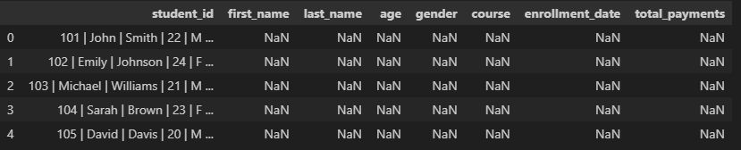
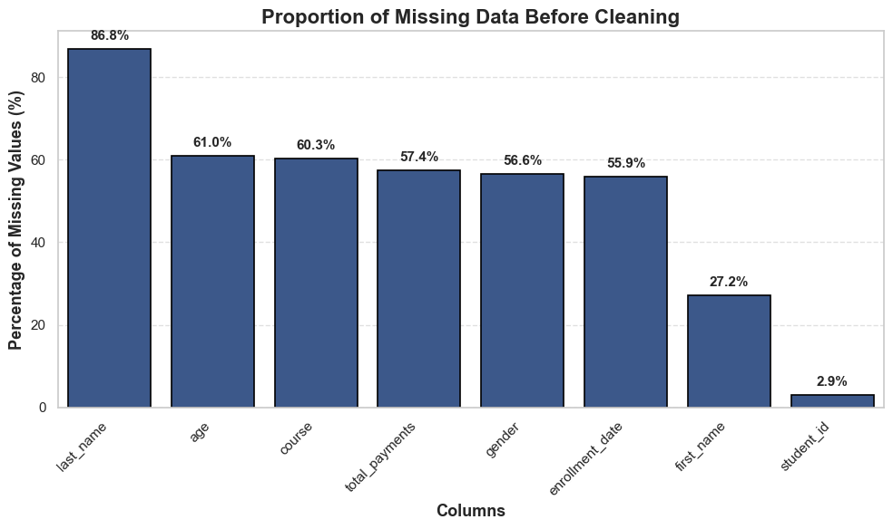
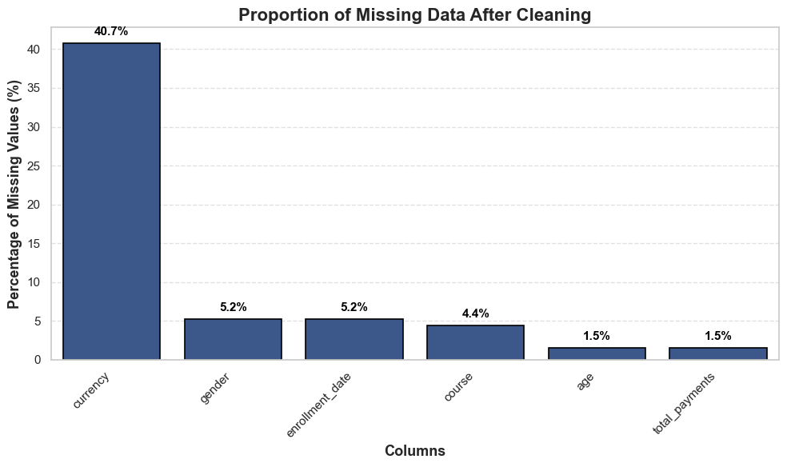
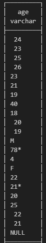
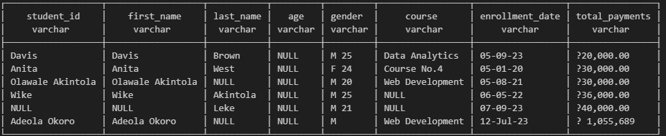
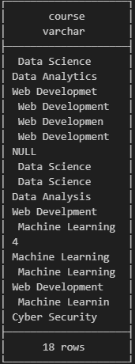
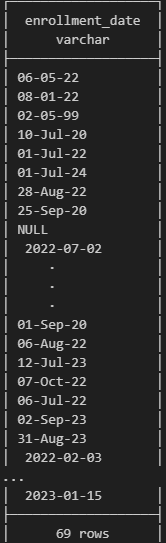
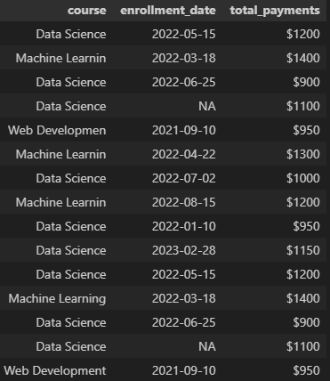

# Student Enrollment Records – Data Cleaning & Standardization

**Tags:**  

---

# Table of Contents

- [1. Project Overview](#1-project-overview)
- [Dataset Description](#dataset-description)
- [2. Data Structure Overview](#2-data-structure-overview)
- [3. Executive Summary](#3-executive-summary)
- [4. Insights Deep Dive (Dataset Evidence)](#4-insights-deep-dive-dataset-evidence)
- [5. Data Cleaning Pipeline](#5-data-cleaning-pipeline)
- [6. Consolidations](#6-consolidations)
- [7. Project Deliverables](#7-project-deliverables)
- [8. Key Takeaways](#8-key-takeaways)

---

# 1. Project Overview

## Title

**Student Enrollment Records Data Cleaning Project**

---

## Project Context

This project was commissioned by the **Education Administration Department**, which maintains student enrollment records across multiple academic programs.

The dataset used for reporting and administrative tracking was found to contain **significant data quality issues caused by manual entry processes**. These issues included:

- inconsistent formatting  
- missing values  
- multiple attributes stored in a single column  

Administration required the dataset to be **cleaned, standardized, and structured according to defined business rules**.

---

## Project Goal

The objective of this project was to design and implement a **structured data-cleaning pipeline** to transform the dataset into a **reliable and analysis-ready format**.

### Key Business Rules

| Business Rule | Description |
|---|---|
| Enrollment Date Format | `enrollment_date` must follow the **YYYY-MM-DD** format |
| Gender Standardization | `gender` must be standardized to **M or F** |
| Payment Format | `total_payments` must store **numeric values only**, with currency symbols extracted |
| Data Normalization | Fields containing **trapped data** must be separated into correct columns |
| Student Identifier | Every record must contain a **valid `student_id`** |

---

# Dataset Description

The dataset contains **student enrollment records** used by the education administration for tracking:

- student registrations  
- course enrollment  
- payment information  
- demographic attributes  

The raw dataset contained **structural inconsistencies**, including:

- merged columns  
- inconsistent formatting  
- missing values  
- mixed datatypes  

These issues required a **structured data cleaning workflow** before the dataset could be used reliably.

---

# 2. Data Structure Overview

## Dataset Overview

This dataset represents **student enrollment records** used by the education administration department to track **course participation and payments**.

Each record represents **one student enrollment instance**.

---

## Dataset Snapshot

*Snapshot of the dataset after initial load.*

---

## Key Columns Overview

| Column Name | Purpose / Notes |
|---|---|
| student_id | Unique identifier for each student, standardized and validated |
| first_name | Student first name |
| last_name | Student last name |
| age | Numeric age, standardized |
| gender | Uppercase `M` / `F` |
| course | Course name cleaned and standardized |
| enrollment_date | Standardized to `YYYY-MM-DD` |
| total_payments | Numeric value only; currency captured separately |
| currency | Extracted from `total_payments` |

---

# 3. Executive Summary

During the **initial inspection of the dataset**, several major **data quality issues** were discovered.

---

## Major Observations

### Large Amounts of Missing Data

Many records contained **very limited information**, with some rows missing **up to ~80% of the expected attributes**.

---

### Uneven Data Distribution

A small subset of records contained **most of the usable information**, while the majority of records were **partially incomplete**.

---

### Trapped or Concatenated Data

Multiple attributes were stored in **a single column**, particularly within the **`student_id` field**.

---

### Combined Attributes

Some records stored **gender and age together**, such as:

M 24

---

### Inconsistent Formats

Course names, payment values, and enrollment dates were **entered inconsistently**.

These issues made the dataset **unsuitable for reporting or analysis in its raw form**.

---

## Cleaning Strategy

To address these issues, a **stepwise data cleaning pipeline** was designed.

The pipeline focuses on:

- identifying **trapped or misplaced data**  
- distributing data into **appropriate columns**  
- standardizing formats according to **business rules**  
- resolving **missing or inconsistent values**  
- restructuring the dataset for **easier reporting**

---

## Data Cleaning Approach

---

### Before Cleaning

### After Cleaning

These visualizations illustrate how the cleaning pipeline **reduced missing values and improved overall dataset completeness**.
---

# 4. Insights Deep Dive (Dataset Evidence)

Instead of describing issues abstractly, this section presents **dataset snapshots that reveal the problems identified during inspection**.

---

## Trapped Data in `student_id`

Several records stored **multiple attributes inside the `student_id` column** using the `|` separator.

### Example Record

1032|John|Doe|21|M|Data S|2023-01-12|$2000

This single value contains:

- student id  
- first name  
- last name  
- age  
- gender  
- course  
- enrollment date  
- payment value  

These values needed to be **split into separate columns**.

---

## Gender and Age Combined

Some records stored **gender and age together**.

### Example

| first_name | gender | age |
|------------|--------|-----|
| John       | M 24   | NULL |

This required **extracting age values and standardizing gender**.

---

## Course Naming Inconsistencies

Course values appeared in **multiple formats**.

These values needed to be **standardized into consistent course names**.

---

## Enrollment Date Formatting Issues

Enrollment dates appeared in **multiple inconsistent formats**.

Dates were standardized to:

YYYY-MM-DD

---

## Payment Values Mixed With Currency

Financial values included **currency symbols embedded within numeric values**.

### Example

$2000
€1500
?2099

To make the data usable for calculations, **currency symbols needed to be separated from numeric values**.

---

# 5. Data Cleaning Pipeline

The full cleaning pipeline is implemented in the project notebook.

📓 **Notebook Location**

`Student_Enrollment_data-cleaning/Data-cleaning-Student_Records.ipynb`

The notebook contains:

- SQL transformation steps  
- DuckDB queries  
- Data validation checks  
- Cleaning workflow documentation  

This notebook represents the **complete reproducible pipeline used to clean the dataset**.
---

# 6. Consolidations

During the **final stage of cleaning**, several structural adjustments were made.

---

## Column Changes

### Added Columns

- `currency`  
- `display_name`  
- `id_status`

### Removed / Consolidated Columns

- `first_name`  
- `last_name`

These were replaced with a new column:

display_name = first_name + last_name

---

## Reason for Consolidation

Name values were **inconsistently distributed**:

- some records had **only a first name**  
- some records stored **multiple names in one field**  
- some **last names were missing**

Using `display_name` provided a **clean reporting-friendly placeholder without introducing ambiguity**.

---

## Remaining Limitations

This cleaning process significantly improved the dataset, but it **does not fully resolve every underlying issue**.

Some column overlaps remain due to:

- inconsistent original entry  
- incomplete records  
- ambiguous name structures  

These issues were adjusted for where possible but ideally should be addressed **at the source system during data entry**.

---

# 7. Project Deliverables

## Outputs

- Cleaned dataset  
- SQL cleaning scripts  
- Jupyter Notebook workflow  
- Data quality visualizations  
